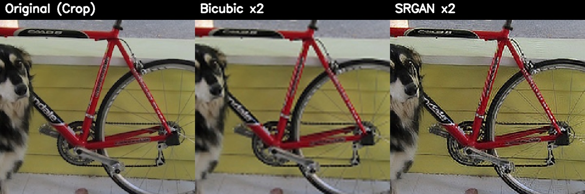
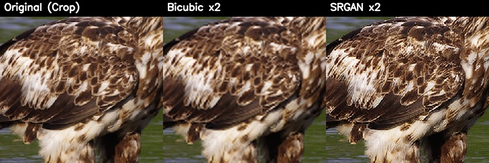
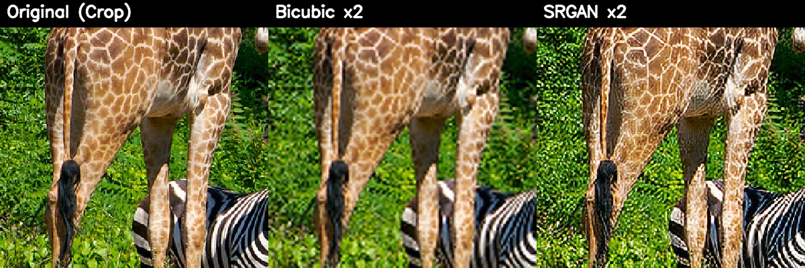
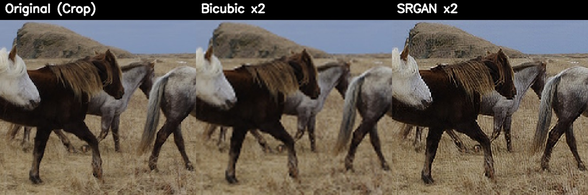

# ReSkayl

Implementation project to implement the GAN-upscaler defined at <a href="https://arxiv.org/pdf/1609.04802">here</a>

Model weights can be found at `model/srgan.pth`.

CLI Tool coming soon

## Todo
- [X] Create default model structure as a `pytorch.nn.module`
- [ ] Create smaller model for lower end systems
- [X] Train model with Flickr2K dataset
- [x] Create results showcase/blogpost
- [ ] UI/UX
  - [x] Make standalone CLI tool
    - [x] User specified model as arg
    - [x] Single file support
    - [x] Support for all files in a directory
  - [ ] Make GUI tool(web or native? hmm)

## CLI Usage

I recommend using [`uv`](https://github.com/astral-sh/uv) to manage the virtual environment reproducibly matching exact dependencies:

```bash
uv venv
uv pip sync requirements.txt
uv pip install -e .
```

Alternatively, you can install ReSkayl as a command-line tool using standard pip. Clone or download the repository, then run:

```bash
pip install -e .
```

Once installed, you can upscale images using the `reskayl` command. The CLI automatically attempts to use CUDA for acceleration, with built-in fallback to CPU if CUDA is unavailable or runs out of VRAM.

### Examples

**Upscale a single image:**
```bash
reskayl -i path/to/image.jpg -o path/to/output_dir
```

**Upscale all images in a directory:**
```bash
reskayl -i path/to/input_dir -o path/to/output_dir
```

## Results Showcase

Below are heavily pixelated inputs upscaled using our SRGAN model versus traditional Bicubic interpolation:





